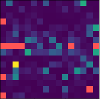

# Articulatory Settings in Electrocorticography

Code for electrocorticography (ECoG) data pre-processing and signal analysis written for Easthope et al. [_"Cortical control of posture in fine motor skills: evidence from inter-utterance rest position"_](https://doi.org/10.3389/fnhum.2023.1139569) (2023).



If you use this code in your own work, please cite our paper:

```bibtex
@article{10.3389/fnhum.2023.1139569,
  author={Easthope, Eric and Shamei, Arian and Liu, Yadong and Gick, Bryan and Fels, Sidney},
  title={Cortical control of posture in fine motor skills: evidence from inter-utterance rest position},
  journal={Frontiers in Human Neuroscience},
  volume={17},
  year={2023},
  url={https://www.frontiersin.org/articles/10.3389/fnhum.2023.1139569},       
  doi={10.3389/fnhum.2023.1139569},      
  issn={1662-5161}
}
```

---

Copyright (c) 2022-2023. All rights reserved.
